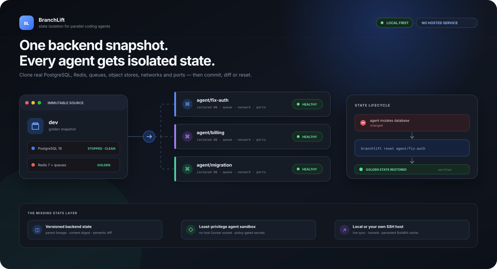

# BranchLift

**Lift a full backend into every worktree.**

[](https://github.com/MuratKomurcu1/BranchLift/actions/workflows/ci.yml)
[](https://www.npmjs.com/package/branchlift)
[](https://github.com/MuratKomurcu1/homebrew-tap)
[](LICENSE)

BranchLift gives parallel coding agents isolated, stateful backend environments. Git worktrees separate source files; BranchLift also separates PostgreSQL, Redis, queues, object stores, Docker networks, and published ports. Its control plane adds immutable state lineage, a least-privilege agent sandbox, scoped secret injection, SSH workers, a local UI, audit events, and MCP tools.



```text
main snapshot
├── agent/fix-auth      → isolated worktree + PostgreSQL + Redis + ports
├── agent/billing       → isolated worktree + PostgreSQL + Redis + ports
└── agent/migration     → isolated worktree + PostgreSQL + Redis + ports
```

It is local-first, agent-agnostic, self-hosted, and has no BranchLift account, hosted service, or paid dependency.

## Where BranchLift fits

The 2026 parallel-agent ecosystem has excellent **session orchestrators** — Conductor, Vibe Kanban, Claude Squad, Nimbalyst — that launch agents on worktrees and visualize diffs. Runtime orchestrators such as [Coasts](https://github.com/coast-guard/coasts) go further with isolated containers, seeded volumes, agent shells, secrets, and remote development. Cloud platforms such as Codespaces, DevPod, and E2B isolate whole machines.

BranchLift goes deepest on the **versioned backend-state layer**. Whatever creates your worktree or agent session, BranchLift gives it real Compose state that can be mutated, committed as a content-addressed child snapshot, diffed semantically, and reset. It also provides a least-privilege Docker sandbox and turns machines you already control into workers over strict-host-key SSH.

| Capability | Session orchestrators | Coasts | Cloud dev VMs | **BranchLift** |
|---|---|---|---|---|
| Agent/worktree workspace UX | ✅ core | ✅ core | partial | attaches through hooks + MCP |
| Seeded isolated backend state | usually shared | ✅ seeded volumes | whole-VM image | ✅ any discovered Compose volume |
| Commit → parent lineage → semantic diff → reset | ❌ | not documented | image/snapshot level | ✅ core data-plane contract |
| Agent execution boundary | usually host | container / DinD model | ✅ VM-sized | ✅ no host socket, policy-gated |
| Remote machine you already own | uncommon | ✅ remote service | provider-dependent | ✅ plain SSH, no public daemon |
| Persistent remote builds and cache | uncommon | runtime-oriented | provider-dependent | ✅ repository-scoped BuildKit |
| Local lifecycle/security/audit UI | partial | ✅ workspace UI | provider UI | ✅ token-protected state control plane |

Use Coasts when you want a broader all-in-one agent workspace and DinD-style runtime orchestration. Use BranchLift when database/queue/cache mutations must be reproducible, reviewable, resettable, and portable across local and SSH hosts. They can also compose: BranchLift is deliberately useful underneath whichever session layer wins.

See [docs/COMPARISON.md](docs/COMPARISON.md) for the detailed August 2026 landscape review.

## The problem

Running Codex, Claude, Cursor, or another coding agent in separate worktrees only isolates code. Stateful backends still collide:

- migrations modify the same database;
- workers consume another agent's jobs;
- tests flush a shared Redis instance;
- Compose stacks compete for fixed ports and container names;
- every new stack starts empty and repeats slow migrations and seeds.

BranchLift prepares one stopped, immutable golden snapshot and clones its state for each branch. On APFS, Btrfs, and reflink-capable XFS, the clone initially shares disk blocks with the snapshot and only changed blocks consume new space.

## Current status

**The current main branch** covers PostgreSQL 16, MySQL 8.4 LTS, and Redis 7 in one real Docker end-to-end contract. It imports an existing stopped-consistent Compose state, garbage-collects old runtimes safely, and runs public Linux lifecycle evidence against pinned Docmost, n8n, and Langfuse stacks. The v2 control and data planes described below are implemented on the current main branch.

Supported today:

- Docker Compose 2.24.4+;
- Git worktrees;
- named-volume discovery and isolation;
- PostgreSQL on macOS Docker Desktop and Linux;
- MySQL 8.4 LTS on macOS Docker Desktop and Linux;
- Redis and generic named volumes;
- APFS clonefile and Linux reflink, with recursive-copy fallback;
- resource-limited Docker sandbox execution with all Linux capabilities dropped, `no-new-privileges`, a read-only root, no host Docker socket, and `none`, backend-only, or outbound networking;
- host agent commands only after an explicit project policy opt-in;
- scoped env and read-only `/run/secrets/...` file injection without writing secrets into a worktree;
- multiple merged Compose files, with legacy `compose.file` compatibility;
- immutable snapshot listing and dependency-protected deletion;
- runtime audits and conservative orphan cleanup through `doctor --fix`;
- cross-process snapshot and instance locks with stale-owner diagnosis;
- context-aware host commands through `branchlift exec`;
- crash recovery for abandoned snapshot builds and instance creation;
- attachment to worktrees already created by Codex, Claude, an IDE, or the user;
- idempotent session-start hooks for Codex, Claude Code, and Cursor;
- a local MCP server exposing attach, runtime health/logs, security posture, snapshots/diffs, audit events, and sanitized remote inventory;
- live service/health inspection through `preview` and targeted Compose logs.
- crash-consistent snapshot import from an existing Compose project;
- age-filtered, lock-rechecked garbage collection for stopped and failed runtimes;
- pinned compatibility contracts for Langfuse, n8n Hosting, Docmost, Twenty, and Immich;
- public Linux lifecycle evidence for Docmost, n8n Hosting, and the six-service Langfuse stack;
- parallel multi-volume cloning and port discovery;
- a recorded 512 MiB Btrfs reflink benchmark with raw samples.
- content-addressed snapshot manifests, parent lineage, crash-consistent instance commits, and semantic snapshot diffs;
- a loopback-only, token-protected control-plane UI for lifecycle, state, security, audit, and remote operations;
- strict-host-key SSH workers with an allowlisted protocol and user-scoped, sudo-free worker setup.
- one-command remote development with conflict-detecting live working-tree sync and automatic loopback SSH port tunnels;
- sandbox-forced remote agent shells with no host-shell or Docker-socket access;
- persistent repository-scoped BuildKit builders with remote build and exact-confirmation cache management.

MongoDB, Kafka, Windows, and Podman are not yet claimed as production-ready. Existing Compose state can be imported from managed named volumes, but a database-specific production claim still requires its own crash-consistency E2E contract.

## Install

Requirements: Node.js 22+, Git, Docker, and Docker Compose 2.24.4+.

```bash
npm install -g branchlift

# or
brew tap MuratKomurcu1/tap
brew trust --formula MuratKomurcu1/tap/branchlift
brew install branchlift
```

Homebrew 6 requires the explicit trust step for every non-official tap formula.
The versioned GitHub Release tarball remains available as an npm-registry-independent fallback.

See [docs/INSTALL.md](docs/INSTALL.md) for requirements, source installation, and package verification.

## Quick start

Run this inside an existing Git repository containing `compose.yaml` or `docker-compose.yml`:

```bash
branchlift init --dry-run
branchlift init
branchlift inspect
branchlift security trust
```

`init` creates `branchlift.yaml`. Commit that file, then build the golden backend once:

It automatically includes the standard `compose.override.yaml`/`docker-compose.override.yml` companion and copies only `.env`/`.env.local` files that actually exist. Use repeated `--compose` options for non-standard merge stacks.

```bash
branchlift snapshot dev
```

If the project's normal Compose stack already contains the state you want, import it instead of rebuilding and reseeding it:

```bash
branchlift snapshot import dev

# Supply the same project name used by `docker compose -p` when needed
branchlift snapshot import dev --project my-existing-stack
```

Import records the currently running services, stops only those services for a crash-consistent filesystem copy, and restores them before returning. The resulting snapshot is immutable; BranchLift never clones a running database.

Spawn isolated branches, then run a reviewed command inside the default Docker security boundary:

```bash
branchlift spawn agent/fix-auth
branchlift sandbox run agent/fix-auth --read-only-worktree -- npm test
branchlift list
```

If a tool has already created and checked out a worktree, run this from that worktree instead:

```bash
branchlift attach
```

Attached worktrees are recorded as externally owned. BranchLift manages their backend state but never removes the worktree itself.

The sandbox image must already exist locally; BranchLift never pulls and executes an unreviewed image implicitly. Build an image containing Codex, Claude Code, or your other tools, set `security.sandbox.image`, then run the agent through `branchlift sandbox run`. Legacy `spawn -- AGENT` host execution remains available only when `security.allowHostAgentCommands` is explicitly enabled.

Install automatic session-start attachment and the project-scoped MCP server without replacing existing agent settings:

```bash
branchlift agents install all
git add .codex .claude .cursor .mcp.json
```

Use `codex`, `claude`, or `cursor` instead of `all` to configure only one client. Codex asks you to review and trust a new project hook before its first run.

Inspect exact ports and live Compose service health, then read one service's logs:

```bash
branchlift preview
branchlift logs agent/fix-auth --service postgres --tail 100
```

Run tests, migrations, or another tool inside an existing instance's worktree and environment:

```bash
branchlift exec agent/fix-auth -- npm test
```

Reset an environment to the immutable snapshot:

```bash
branchlift reset agent/fix-auth
```

Clean up runtime state while preserving the Git worktree and branch:

```bash
branchlift destroy agent/fix-auth
```

Preview or remove old stopped/failed environments in bulk:

```bash
branchlift gc --older-than 7d --dry-run
branchlift gc --older-than 7d
```

Garbage collection never selects running/creating instances, rechecks candidates under their lifecycle lock, and removes only BranchLift-owned worktrees. External worktrees are preserved.

Remove the worktree too, but only if it is clean:

```bash
branchlift destroy agent/fix-auth --worktree
```

BranchLift never deletes the Git branch.

## Configuration

`branchlift init` generates a minimal file:

```yaml
version: 1
compose:
  files:
    - compose.yaml
  statefulServices:
    - postgres
    - redis
snapshot:
  default: dev
  healthTimeoutSeconds: 120
  seed: []
worktree:
  copyFiles:
    - .env
```

Snapshot seed commands execute inside an already healthy Compose service:

```yaml
snapshot:
  default: dev
  healthTimeoutSeconds: 120
  seed:
    - service: api
      command: ["npm", "run", "db:migrate"]
    - service: api
      command: ["npm", "run", "db:seed"]
```

The snapshot stack is shut down cleanly before its filesystem state is made available for cloning.

Projects that normally use an override can list files in Compose merge order:

```yaml
compose:
  files:
    - compose.yaml
    - compose.dev.yaml
```

The older `compose.file: compose.yaml` form remains readable.

Project execution policy is committed, while its machine-local approval and secret values are not:

```yaml
security:
  sandbox:
    backend: docker
    image: my-reviewed-agent:local
    network: backend
    readOnlyRoot: true
    memory: 4g
    cpus: 2
    pidsLimit: 512
  allowHostAgentCommands: false
  allowSecretCommands: false
secrets:
  apiToken:
    source: { env: MY_API_TOKEN }
    target: { env: API_TOKEN }
    scopes: [sandbox]
    required: true
  credentials:
    source: { file: ~/.config/my-app/credentials.json }
    target: { file: /run/secrets/credentials.json }
    scopes: [sandbox]
    required: true
ui: { host: 127.0.0.1, port: 7788 }
```

File targets are restricted to `/run/secrets/...` and the sandbox scope. Command secret sources and host agent commands are blocked by default. See [docs/SECURITY-AND-SECRETS.md](docs/SECURITY-AND-SECRETS.md).

After reviewing `branchlift.yaml`, run `branchlift security trust`. BranchLift stores only its digest outside the worktree. Any configuration change invalidates the approval and blocks Compose lifecycle/snapshot operations, sandbox execution, secret resolution, and host-agent execution until the new digest is reviewed and trusted.

Commit a useful mutated instance as a child snapshot and compare it without starting a database:

```bash
branchlift snapshot commit migrated --from agent/fix-auth
branchlift snapshot diff dev migrated
```

Open the local control plane or register a machine you control over SSH:

```bash
branchlift ui
branchlift remote add lab 192.0.2.10 --user developer --repo /srv/my-project
branchlift remote sync lab --snapshot dev
branchlift remote launch lab agent/fix-auth --snapshot dev
branchlift remote dev lab agent/fix-auth --snapshot dev
```

`remote sync` automatically installs/verifies the user-scoped worker, transfers the exact committed Git `HEAD`, and sends only snapshot blobs the remote does not already have. `remote launch` adds an exact-commit worktree and isolated backend. `remote dev` then mirrors tracked plus untracked-nonignored working files, opens loopback SSH forwards for discovered TCP services, and keeps reconciling until stopped. Live sync is one-way and refuses remote edits rather than overwriting them. No cloud account, subscription, public control daemon, or Docker-in-Docker daemon is required. See [docs/REMOTE.md](docs/REMOTE.md).

## Commands

```text
  branchlift init [--compose FILE]... [--dry-run] [--json]
branchlift inspect [--json]
branchlift snapshot [create] [NAME]
branchlift snapshot import [NAME] [--project COMPOSE_PROJECT] [--json]
branchlift snapshot list [--json]
branchlift snapshot delete NAME
branchlift spawn BRANCH [--snapshot NAME] [--no-start] [-- AGENT ...]
branchlift attach [--snapshot NAME] [--no-start] [-- AGENT ...]
branchlift start BRANCH [-- AGENT ...]
branchlift stop BRANCH
branchlift exec BRANCH -- COMMAND ...
branchlift reset BRANCH [--no-start]
branchlift list [--json]
branchlift preview [BRANCH] [--json]
branchlift logs [BRANCH] [--service NAME] [--tail N] [--follow] [--timestamps]
branchlift destroy BRANCH [--worktree]
branchlift doctor [--fix] [--json]
branchlift gc [--older-than 7d] [--dry-run] [--json]
branchlift benchmark [SNAPSHOT] [--iterations N] [--json]
branchlift agents install [all|codex|claude|cursor] [--dry-run] [--json]
branchlift mcp
branchlift remote dev REMOTE BRANCH [--snapshot NAME] [--trust-policy] [--no-tunnel]
branchlift remote live-sync REMOTE BRANCH
branchlift remote watch REMOTE BRANCH [--interval MS]
branchlift remote tunnel start|status|stop|watch REMOTE BRANCH
branchlift remote shell REMOTE BRANCH [--network none|backend|outbound]
branchlift remote agent REMOTE BRANCH [--read-only-worktree] -- COMMAND ...
branchlift remote build REMOTE --tag IMAGE [--branch BRANCH] [--network default|none] [--cache-max 20gb]
branchlift remote cache inspect REMOTE
branchlift remote cache prune REMOTE --confirm prune
```

When an agent is launched, BranchLift supplies:

```text
BRANCHLIFT_INSTANCE
BRANCHLIFT_CONTEXT
BRANCHLIFT_WORKTREE
COMPOSE_PROJECT_NAME
BRANCHLIFT_<SERVICE>_<CONTAINER_PORT>_HOST
BRANCHLIFT_<SERVICE>_<CONTAINER_PORT>_PORT
BRANCHLIFT_<SERVICE>_<CONTAINER_PORT>_URL
```

`BRANCHLIFT_CONTEXT` points to JSON containing the assigned host ports and service endpoints. For example, a PostgreSQL service exposing container port 5432 receives `BRANCHLIFT_POSTGRES_5432_PORT`.

`snapshot delete` refuses to remove a snapshot while any instance references it. `doctor` checks snapshot contents, metadata references, worktrees, Compose files, lifecycle locks, runtime status, and Docker resources. `doctor --fix` removes verified stale locks, reconciles abandoned operations, and removes exact BranchLift-labeled orphan resources. Recovered snapshot data is renamed into `.failed-recovered-*` diagnostic state rather than deleted. Git branches, worktrees, and managed database state directories are not silently discarded.

## Safety model

BranchLift inspects Compose before mutating runtime state and refuses configurations that would only appear isolated:

- fixed `container_name` values;
- `network_mode: host`;
- external named volumes;
- detected stateful services without a managed named volume.

Shared writable bind mounts are reported as warnings, or blockers when they belong to a stateful service. Randomized instance ports are always published on loopback rather than widened to every host interface. `.env` is copied with owner-only permissions when it is absent from the worktree; symlink sources and destination-parent escapes are rejected.

Diagnostics include a concrete recommendation for every isolation blocker. Interpolated or absolute bind sources are treated conservatively as shared. Generated overrides replace managed mount targets without deleting unrelated bind, tmpfs, secret, or config mounts from the source project.

Mutating commands acquire owner-stamped filesystem locks. A conflicting command fails instead of racing database copies or Compose teardown. Agent and `exec` child processes run outside lifecycle locks so long-running tools do not prevent intentional runtime control.

Instances created by `spawn` own their generated worktree. Instances created by `attach` mark the current worktree as external. `destroy --worktree` refuses external ownership before stopping or removing anything; plain `destroy` removes only BranchLift runtime state.

`branchlift exec` and explicitly enabled host agent commands are **not** security boundaries. `branchlift sandbox run` adds a hardened Docker boundary around the command, but it is not a VM boundary and it deliberately grants the selected worktree and any scoped backend/secret access. Compose application services retain their own image and Compose security settings. See [SECURITY.md](SECURITY.md) and [docs/SECURITY-AND-SECRETS.md](docs/SECURITY-AND-SECRETS.md).

## Storage behavior

Runtime state lives outside the repository:

```text
~/.branchlift/
├── repos/<repo-id>/snapshots/<name>/volumes/
├── repos/<repo-id>/instances/<branch>/volumes[-<generation>]/
├── repos/<repo-id>/locks/
├── repos/<repo-id>/live-sync/
├── repos/<repo-id>/remote-tunnels/
├── repos/<repo-id>/events.jsonl
├── remotes.json
└── worktrees/<repo-id>/<branch>/
```

Override the root with `BRANCHLIFT_HOME`.

Copy strategy order:

1. macOS APFS clonefile (`cp -c`);
2. Linux reflink (`cp --reflink=always`);
3. safe recursive copy fallback.

Each ready snapshot's volume tree is made host-read-only after its digest manifest is written. Provisioning restores owner-only write access to the cloned runtime state, never world-write access. Each reset clones into a never-before-mounted volume generation and switches the generated Compose override only after the clone validates. The previous generation is removed after the replacement stack becomes healthy. This avoids Docker Desktop bind-cache races and never exposes a half-copied reset as the active path.

Measure clone latency against a forced full-copy baseline on your machine:

```bash
branchlift benchmark dev --iterations 10
```

For a database-independent fixture use `npm run benchmark:synthetic -- --size-mib 256 --iterations 7`. For the pinned Docmost comparison use `npm run benchmark:docmost -- --dataset-mib 128 --iterations 3`.

The recorded Docmost result is deliberately not presented as a win: its real APFS state clone was 2.51× faster than full copy, but the complete HTTP-ready path was 0.82× because Docker Desktop starts the bind-mounted PostgreSQL state more slowly. On the public Linux Btrfs run, the 512 MiB synthetic clone median was 31.25 ms versus 600.95 ms for forced full copy, a 19.23× speedup. Methodology, raw evidence, and negative controls are in [docs/BENCHMARKS.md](docs/BENCHMARKS.md).

## Development

```bash
npm install
npm run check
npm test

# Requires a running Docker daemon and pulls postgres:16-alpine, mysql:8.4, and redis:7-alpine
npm run test:e2e

# Fetches five pinned public Compose projects
npm run test:compat

# Typecheck, unit tests, audit, and package dry-run
npm run verify
```

See [docs/COMPATIBILITY.md](docs/COMPATIBILITY.md), [docs/EVIDENCE.md](docs/EVIDENCE.md), [docs/ARCHITECTURE.md](docs/ARCHITECTURE.md), [docs/SECURITY-AND-SECRETS.md](docs/SECURITY-AND-SECRETS.md), [docs/REMOTE.md](docs/REMOTE.md), and [CONTRIBUTING.md](CONTRIBUTING.md) for the exact support contract and public lifecycle evidence.

The architecture is documented in [docs/ARCHITECTURE.md](docs/ARCHITECTURE.md).

## Community

- Bug reports and feature proposals: [GitHub Issues](https://github.com/MuratKomurcu1/BranchLift/issues)
- Questions and show-and-tell: [GitHub Discussions](https://github.com/MuratKomurcu1/BranchLift/discussions)
- Contributions: [CONTRIBUTING.md](CONTRIBUTING.md) — `npm run verify` must pass before every PR.
- Security reports: [SECURITY.md](SECURITY.md) — please use private security advisories rather than public issues.

If BranchLift saves you a reseed cycle, star the repository — it is the main discovery signal for an independent, non-VC project in this category.

## License and provenance

Apache-2.0. BranchLift is an original implementation. It is informed by the public behavior and product ideas of worktree environment tools and database branching systems, but does not copy their source or claim their work as its own.
